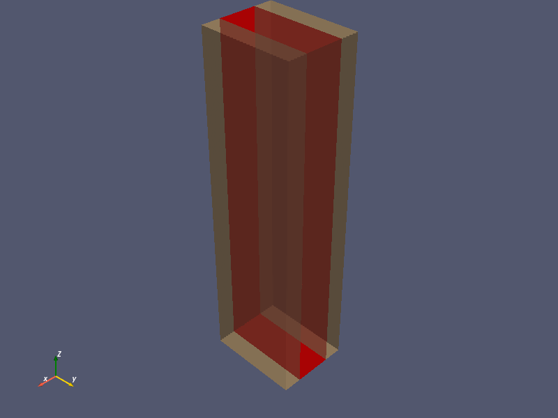
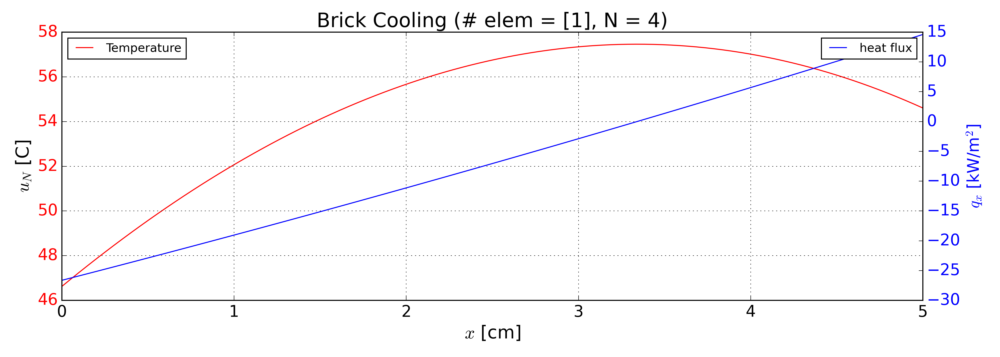

# FIRES Brick

UMass Lowell Fall 2024  
Dept. of Chemical Engineering, Nuclear Program  
Engy-4390: Nuclear System Design & Analysis  

View the project (python) on `NBViewer`: 

Run the project (python) on `Binder`: 

  >**Students:** [Kyle Mills](https://github.com/KMills245), [Billy Manco](https://github.com/Bmanco), and [Donaita Anglade](https://github.com/Donaita)  
  >**Mentor/Collaborator:** [Prof. Valmor F. de Almeida](https://github.com/dealmeidavf), [Prof. Subash Sharma](https://github.com/SubashSharma1008)  
  >[Dept. of Chemical Engineering (Nuclear Energy Program)](https://www.uml.edu/Engineering/Chemical/faculty/de-Almeida-Valmor.aspx)  
  >University of Massachusetts Lowell, USA  

|  |
|:---:|
|  |
| 
<b>Firebrick model, visulizing the brick in red with air channels on either side modeled in yellow.</b>
 |
|  |
| 
<b>Temperature Distribution versus Heat Flux graph showing how a FIRE brick is heated</b>
 |

References:
 + [Eng-5330: Computational Continuum Transport Phenomena: course notes](https://github.com/dpploy/engy-5330)
 + [Daniel Stack, [Development of high-temperature firebrick resistance-heated energy storage (FIRES) using doped ceramic heating system](https://dspace.mit.edu/bitstream/handle/1721.1/130800/1252204287-MIT.pdf?sequence=1&isAllowed=y)
 + [James F. Shackleford, [CRC Materials Science and Engineering Handbook](https://www.perlego.com/book/1604331/crc-materials-science-and-engineering-handbook-pdf?campaignid=436439430&adgroupid=1353500607580773&msclkid=6a34f00cf8701419f55b9743a5b1e311)
 + [E.A. Brandes, G.B. Brooke, [Smithtells Metals Reference Book](https://www.sciencedirect.com/book/9780750675093/smithells-metals-reference-book)
 + [“Magnesium Oxide Mgo Optical Material.” Crystran, Crystran](https://www.crystran.com/optical-materials/magnesium-oxide-mgo) Accessed 16 Dec. 2024.
