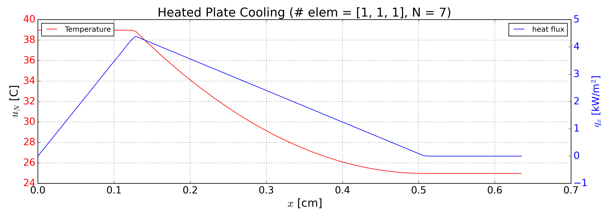

# Heated Plate

UMass Lowell Fall 2024  
Dept. of Chemical Engineering, Nuclear Program  
Engy-4390: Nuclear Systems and Design Analysis 

View the project on `NBViewer`: 

Run the project on `Binder`: 

  >**Student:** [Noah Johnson](https://github.com/Noah-R_Johnson)  
  >**Mentor/Collaborator:** [Prof. Valmor F. de Almeida](https://github.com/dealmeidavf)  
  >[Dept. of Chemical Engineering (Nuclear Energy Program)](https://www.uml.edu/Engineering/Chemical/faculty/de-Almeida-Valmor.aspx)  
  >University of Massachusetts Lowell, USA  

|  |
|:---:|
|  |
| 
<b>Heat transfer between a heated plate, a fluid channel, and an unheated plate.</b>
 |

|  |
|:---:|
|  |
| 
<b>No-flux Neumann boundary conditions on the left with a heat source in the left plate and an equivalent heat sink in the fluid channel with a Robin boundary condition on the far right.</b>
 |

References:

 + [Eng-5330: Computational Continuum Transport Phenomena: course notes](https://github.com/dpploy/engy-5330)
 + [Multiphysics Object-Oriented Simulation Environment (MOOSE)](https://mooseframework.inl.gov/)
