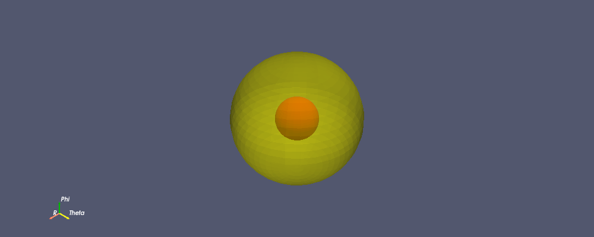

# Neutron Diffusion on a Spherical Domain in Vacuum

UMass Lowell Fall 2024  
Dept. of Chemical Engineering, Nuclear Program  
Engy-4390: Nuclear Systems Design and Analysis

View the project on `NBViewer`: 

Run the project on `Binder`: 

  >**Student:** [Melanie Breeze](https://github.com/harvest-breeze)  
  >**Mentor/Collaborator:** [Prof. Valmor F. de Almeida](https://github.com/dealmeidavf)  
  >[Dept. of Chemical Engineering (Nuclear Energy Program)](https://www.uml.edu/Engineering/Chemical/faculty/de-Almeida-Valmor.aspx)  
  >University of Massachusetts Lowell, USA  

|  |
|:---:|
|  |
| 
<b>Neutron source in the center sphere with diffusion and absorption, and a spherical annulus absorbing/diffusive material.</b>
 |
<!-- |  |
| 
<b>Neutron scalar flux absorption for 3-energy group diffusion.</b>
 | -->

Neutron are particles that are eletrically neutral and can travel through matter with comparatively little interaction. Neutrons are generated by nuclear processes in nuclear reactors, and as such detecting neutrons--by interacting with matter--can be better understood by modelling their diffusion through matter. We strive here to model an idealized case of neutrons being generated and diffused in a spherical domain across two regions: a small inner region, and a larger outer region.

References:

 + [Eng-5330: Computational ransport Phenomena: course notes](https://github.com/dpploy/engy-5330)

