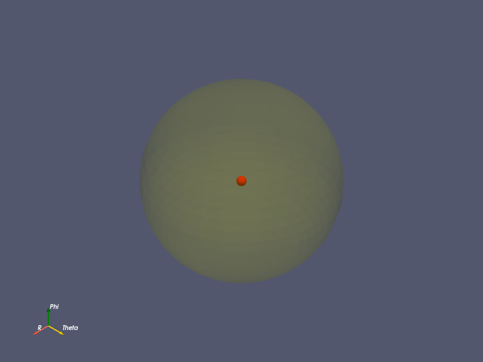

# Neutron Diffusion on a Spherical Domain in Vacuum

UMass Lowell Fall 2024  
Dept. of Chemical Engineering, Nuclear Program  
Engy-4390: Nuclear Systems Design and Analysis

View the project on `NBViewer`: 

Run the project on `Binder`: 

 >[Melanie Breeze](https://github.com/harvest-breeze), and [Prof. Valmor F. de Almeida](https://github.com/dealmeidavf)  
 >[Dept. of Chemical Engineering (Nuclear Energy)](xxx)  
 >University of Massachusetts Lowell, USA  

|  |
|:---:|
|  |
| 
<b>Domain of netron absorption: spherical annulus.</b>
 |
|  |
| 
<b>Neutron scalar flux absorption for 3-energy group diffusion.</b>
 |

References:

 + [Eng-5330: Computational Continuum Transport Phenomena: course notes](https://github.com/dpploy/engy-5330)
 + [Other references, MOOSE etc.](https://github.com/dpploy/engy-5330)

