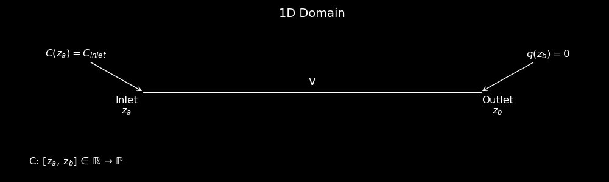

# Tritium Calculation for MSR, No Reaction

UMass Lowell Fall 2024  
Dept. of Chemical Engineering, Nuclear Program  
Engy-4390: Nuclear Systems Design and Analysis

View the project on `NBViewer`: 

Run the project on `Binder`: 

 >[James R. Frye](https://github.com/JamesFrye03), and [Prof. Subash L. Sharma](https://github.com/SubashSharma1008)  
 >[Dept. of Chemical Engineering (Nuclear Energy)](xxx)  
 >University of Massachusetts Lowell, USA  

# Overview
Tritium (T), a radioactive isotope of hydrogen, plays a crucial role in fusion reactions. The U.S. currently produces tritium using lithium control rods at the Watts Bar Nuclear Power Plant, after which it is extracted at the Savannah River Site. This is a batch process that requires tritium to be shipped between facilities for purification, costing between $40-60k per gram. Tritium has a half-life of 12.33 years, and decays at an annual rate of 5.5%; with current existing demand primarily being met by recycling tritium from dismantled nuclear weapons. However, the demand for tritium is projected to rise due to its use in fusion reactors and the need to replenish the U.S. government’s stockpile. Tritium is generated as a byproduct in Molten Salt Reactors (MSRs), which use lithium as part of the molten salt. In these reactors, tritium is a waste product that must be removed from the primary loop before the steam generator to prevent its release into the environment. One method for tritium removal involves permeation through the primary piping under vacuum. This project aims to model this removal method in a 1D frame as an advection-diffusion with a flux out of the pipe wall. 

|  |
|:---:|
|  |
| 
<b>Problem domain sketch.</b>
 |

References:

- [1] V. F. de Almeida, [*Engy-5330: Computational Transport Phenomena*](https://github.com/dpploy/engy-5330),  University of Massachusetts Lowell, Dept. of Chemical Engineering (Nuclear Energy Program).
- [2] V. F. de Almeida, [*Engy-4390: Nuclear System Design and Analysis*](https://github.com/dpploy/engy-4390),  University of Massachusetts Lowell, Dept. of Chemical Engineering (Nuclear Energy Program).
- [3] Multiphysics Object-Oriented Simulation Environment [(MOOSE)](https://mooseframework.org)
- [4] P. Humrickhouse, P. Calderoni, and B. Merrill “Implementation of Tritium Permeation Models in the CFD Code Fluent”
- [5] P. Humrickhouse, B. Merrill “Vacuum Permeator Analysis for Extraction of Tritium from DCLL Blankets”  
- [6] Stempien D. John, “Tritium Transport, Corrosion, and Fuel Performance Modeling in Fluoride Salt-Cooled High-Temperature Reactor (FHR)”. Massachusetts Institute of Technology. PDF. June 2017
- [7] R. Serrano-Lópeza, J. Fraderaa, S. Cuesta-Lópeza. “Molten salts database for energy applications”. PDF. September 2014.
- [8] M. Sugisaki, H. Furuya, K. Ono, K. Idemitsu. “Tritium solubility in SUS-316 stainless steel”. Journal of Nuclear Materials. PDF. February 1984
- [9] B. Garcinuño, D. Rapisarda, I. Fernández-Berceruelo, D. Jiménez-Rey, J. Sanz, C. Moreno, I. Palermo, Á. Ibarra. “Design and fabrication of a Permeator Against Vacuum prototype for small scale testing at Lead-Lithium facility”. Fusion Engineering and Design. PDF. November 2017
