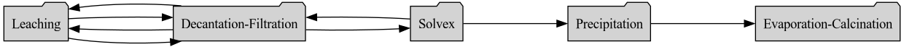

# Uranium Mill Network Dynamics Simulation

UMass Lowell Fall 2024  
Dept. of Chemical Engineering, Nuclear Program  
Engy-4390: Nuclear Systems Design and Analysis

View the project on `NBViewer`: 

Run the project on `Binder`: 

Run usecases on `Binder`: 

 >**Students:** Kyle Rizzuto, Robert Townsend, Jacob Duprey, Kevin McMenemy   
 >**Mentor/Collaborator:** [Prof. Valmor F. de Almeida](https://github.com/dealmeidavf)  
 >[Dept. of Chemical Engineering (Nuclear Energy Program)](https://www.uml.edu/Engineering/Chemical/faculty/de-Almeida-Valmor.aspx)  
 >University of Massachusetts Lowell, USA  

|  |
|:---:|
|  |
| 
<b>Mill Network Graph (Based on White Mesa, Utah, USA).</b>
 |

References:

 + [Cortix](https://cortix.org/)
 + [Eng-4350: Nuclear Reactor Engineering: course notes](https://github.com/dpploy/engy-4350)

