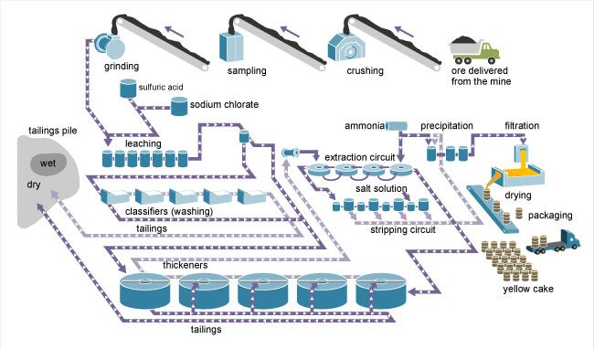

# Uranium Mill Network Dynamics Simulation

UMass Lowell Fall 2024  
Dept. of Chemical Engineering, Nuclear Program  
Engy-4390: Nuclear Systems Design and Analysis

View the project on `NBViewer`: 

Run the project on `Binder`: 

Run usecases on `Binder`: 

 >**Students:** [Alyssa Puglisi](https://github.com/alyssa-puglisi), [Cole Connerty](https://github.com/coleconn9), [Gui Lima](https://github.com/G00BLiMA)   
 >**Mentor/Collaborator:** [Prof. Valmor F. de Almeida](https://github.com/dealmeidavf)  
 >[Dept. of Chemical Engineering (Nuclear Energy Program)](https://www.uml.edu/Engineering/Chemical/faculty/de-Almeida-Valmor.aspx)  
 >University of Massachusetts Lowell, USA  

### Repository Folder Organization
*pics*: all reference photos used in report files  
*reports*: overall and individual process report files  
*src*: individual process initialization python files and run process python files

### Conventional Uranium Milling
Conventional uranium mills are chemical plants that extract uranium through the following process:
1. Uranium ore is delivered to the mill where is it crushed and refined before being leached (extracted by sulfuric acid or alkaline solutions)
1. Extracted uranium is concentrated to a substance known as "yellowcake"
1. Yellowcake is then transported from the mill to a uranium conversion facility where it is processed through the stages of the nuclear fuel cycle

|  |
|:---:|
|  |
| 
<b>Milling Process of Typical Conventional Uranium Mill</b>
 |

### Repository Purpose
This reposititory is oriented around modeling the uranium milling processes that take place at the White Mesa Mill. The White Mesa Mill is the only fully-licensed and operating conventional uranium mill in the United States. The mill is central to the highest-grade uranium mines and deposits in the U.S. 

Our goal is to provide user-friendly White Mesa Mill case scenarios, accessed and run through Jupyter Notebook, of the uranium leaching, decantation/filtration, solvent extraction, precipitation, and evaporation/calcination processes. Cortix is an open-source Python library for enabling development of simulation of network modules and will be used to create a dynamic network of each separation process. 

|  |
|:---:|
|  |
| 
<b>Mill Network Graph (Based on White Mesa, Utah, USA).</b>
 |

#### Installation Instructions

###### Activating Symbolic Links on Windows OS
+ Enable developer mode in Windows Settings > System > For developers
+ Find .gitconfig file in User section of File Explorer
+ Edit .gitconfig file using Notepad application by adding the following section:
[core]  
&nbsp;&nbsp;&nbsp;&nbsp;symlinks = true
+ Reboot your machine
+ Clone engy-4390 into the desktop Github application to run any nb-cases

###### Installing Python Graphviz
+ Open *Windows Powershell* or *Anaconda Prompt*
+ Type 'pip install pydot'
+ Reboot any running Jupyter Notebook files
Graphviz should be properly installed on your Windows device & dynamic stage visuals will run

References:

 + [Cortix](https://cortix.org/)
 + [Eng-4350: Nuclear Reactor Engineering: course notes](https://github.com/dpploy/engy-4350)
+ [NRC: Conventional Uranium Mills](https://www.nrc.gov/materials/uranium-recovery/extraction-methods/conventional-mills.html)
+ [Energy Fuels: White Mesa Mill](https://www.energyfuels.com/white-mesa-mill)
